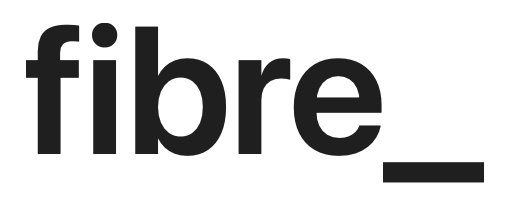

[![Contributors][contributors-shield]][contributors-url]
[![Forks][forks-shield]][forks-url]
[![Stargazers][stars-shield]][stars-url]
[![Issues][issues-shield]][issues-url]
[![MIT License][license-shield]][license-url]

 

  

<h3 align="center">FibreJS</h3>

  

    FibreJS is an extensible business rule engine with a visual editor
     
    <a href="https://github.com/fuchstim/fibrejs/wiki"><strong>Explore the docs »</strong></a>
     
     
    <a href="https://github.com/fuchstim/fibrejs/issues">Report Bug</a>
    ·
    <a href="https://github.com/fuchstim/fibrejs/issues">Request Feature</a>
  

## Installation & Usage

Please refer to the installation and usage guides in the [project wiki](https://github.com/fuchstim/fibrejs/wiki).

## Roadmap

- [ ] Support collection data types
- [ ] Support complex input types in rule preview
- [ ] Customizable node display

See the [open issues](https://github.com/fuchstim/fibrejs/issues)for a full list
of proposed features (and known issues).

[contributors-shield]: https://img.shields.io/github/contributors/fuchstim/fibrejs.svg?style=for-the-badge
[contributors-url]: https://github.com/fuchstim/fibrejs/graphs/contributors
[forks-shield]: https://img.shields.io/github/forks/fuchstim/fibrejs.svg?style=for-the-badge
[forks-url]: https://github.com/fuchstim/fibrejs/network/members
[stars-shield]: https://img.shields.io/github/stars/fuchstim/fibrejs.svg?style=for-the-badge
[stars-url]: https://github.com/fuchstim/fibrejs/stargazers
[issues-shield]: https://img.shields.io/github/issues/fuchstim/fibrejs.svg?style=for-the-badge
[issues-url]: https://github.com/fuchstim/fibrejs/issues
[license-shield]: https://img.shields.io/github/license/fuchstim/fibrejs.svg?style=for-the-badge
[license-url]: https://github.com/fuchstim/fibrejs/blob/master/LICENSE.txt
